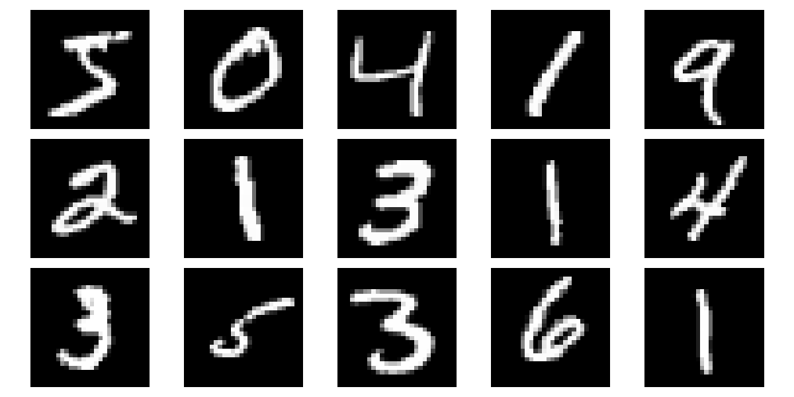
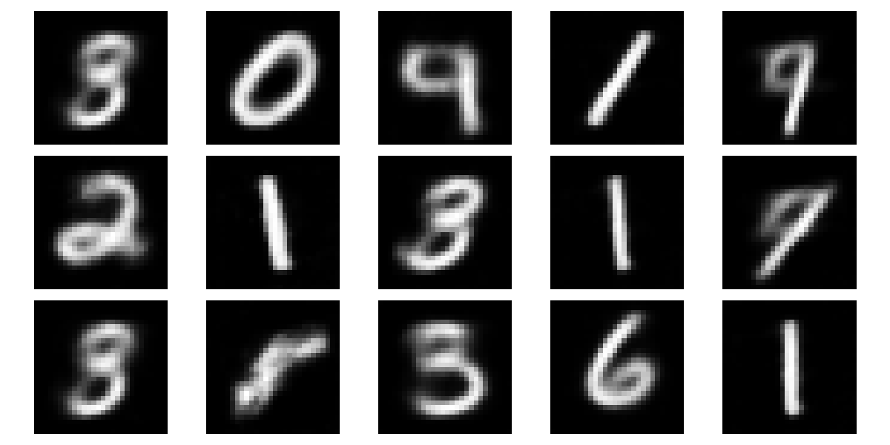
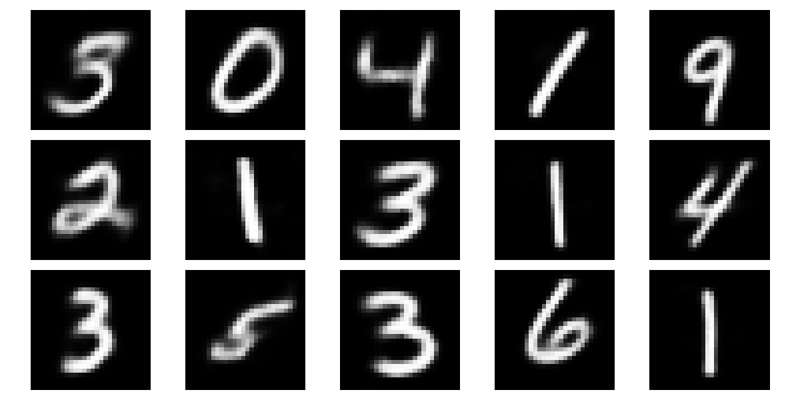

# convolutional-autoencoder-keras

Keras implementation of convolutional autoencoder architecture, and example test with MNIST
## Setup
```
git clone git@github.com:CUN-bjy/convolutional-autoencoder-keras.git
pip install -r requirements.txt
```

## Results
### Original

### latent dim == 2

### latent dim == 5
